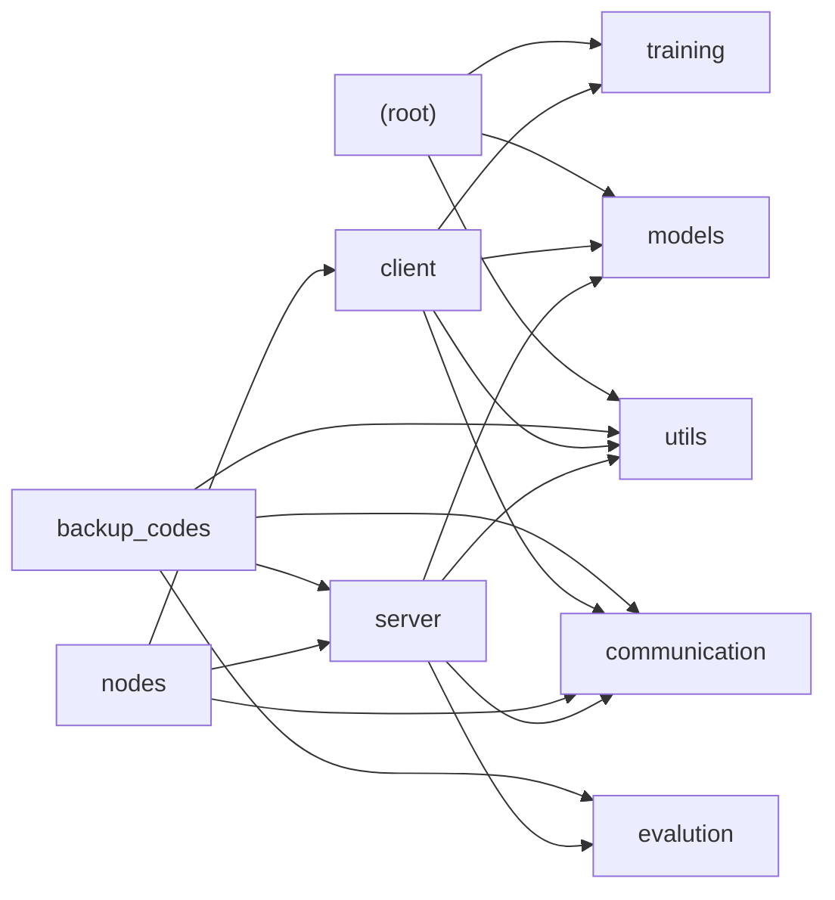

# Repository Map

> Auto-generated by `tools/repo_map.py`. Do not edit by hand — re-run the script to refresh.

- **Files mapped:** 34
- **Total lines of Python:** 1312
- **Generated:** 2026-06-15 13:24 UTC

## Architecture (module dependency graph)

Arrows point from a package to the packages it imports from.



## File tree

```text
backup_codes/
  backup_app(server).py  -- functions root, get_model, receive_update, aggregate_updates
client/
  __init__.py  -- (no top-level docstring or symbols)
  backup_client_code.py  -- functions download_global_model, upload_local_update, main
  client.py  -- Defines class FederatedClient
  local_trainer.py  -- function local_train
communication/
  __init__.py  -- (no top-level docstring or symbols)
  delta.py  -- functions compute_delta, apply_delta
  model_sync.py  -- Defines class ModelSync
  protocol.py  -- (no top-level docstring or symbols)
  registry.py  -- function register_node
  serialization.py  -- functions serialize_weights, deserialize_weights
  updates.py  -- (no top-level docstring or symbols)
evalution/
  evaluate.py  -- function evaluate_model
inference.py  -- function main
main.py  -- function main
models/
  cnn.py  -- Defines class CNN
nodes/
  __init__.py  -- (no top-level docstring or symbols)
  discovery.py  -- Defines class DiscoveryService
  node.py  -- Defines class Node
  peer_table.py  -- Defines class PeerTable
run_federated.py  -- function main
server/
  __init__.py  -- (no top-level docstring or symbols)
  aggregator.py  -- function federated_averaging
  app.py  -- functions root, get_model, receive_update, register_node
  coordinator.py  -- Defines class FederatedCoordinator
  leader_service.py  -- Defines class LeaderService
  model_manager.py  -- Defines class ModelManger
training/
  evaluator.py  -- function evaluate
  trainer.py  -- function train
utils/
  checkpoint.py  -- functions save_checkpoint, load_checkpoint
  config.py  -- function load_config
  logger.py  -- function setup_logger
  partition.py  -- function create_non_iid_partition
  seed.py  -- function set_seed
```

## Files in detail

### `(root)`

#### `inference.py`  (53 LoC)

function main

**Functions:**
- `main()`

**Depends on (internal):** `models.cnn`
**External libs:** `torch`, `torchvision`

#### `main.py`  (82 LoC)

function main

**Functions:**
- `main()`

**Depends on (internal):** `models.cnn`, `training.evaluator`, `training.trainer`, `utils.checkpoint`, `utils.config`, `utils.logger`, `utils.seed`
**External libs:** `data`, `torch`

#### `run_federated.py`  (27 LoC)

function main

**Functions:**
- `main()`

**Depends on (internal):** `utils.config`
**External libs:** `subprocess`, `time`

### `backup_codes`

#### `backup_codes/backup_app(server).py`  (119 LoC)

functions root, get_model, receive_update, aggregate_updates

**Functions:**
- `root()`
- `get_model()`
- `receive_update(update)`
- `aggregate_updates()`

**Depends on (internal):** `communication.delta`, `communication.serialization`, `evalution.evaluate`, `server.aggregator`, `server.model_manager`, `utils.config`
**External libs:** `data`, `fastapi`, `torch`

### `client`

#### `client/__init__.py`  (4 LoC)

(no top-level docstring or symbols)


#### `client/backup_client_code.py`  (62 LoC)

functions download_global_model, upload_local_update, main

**Functions:**
- `download_global_model()`
- `upload_local_update(weights)`
- `main()`

**Depends on (internal):** `client.local_trainer`, `communication.serialization`, `models.cnn`, `utils.config`
**External libs:** `data`, `requests`, `torch`

#### `client/client.py`  (87 LoC)

Defines class FederatedClient

**Classes:**
- `FederatedClient` — methods: __init__, get_leader_url, resolve_target_url, train_round, run

**Depends on (internal):** `client.local_trainer`, `communication.delta`, `communication.model_sync`, `communication.serialization`, `models.cnn`, `utils.config`, `utils.partition`
**External libs:** `data`, `requests`, `sys`, `torch`

#### `client/local_trainer.py`  (36 LoC)

function local_train

**Functions:**
- `local_train(model, train_loader, test_loader, device, local_epochs)`

**Depends on (internal):** `training.evaluator`, `training.trainer`
**External libs:** `torch`

### `communication`

#### `communication/__init__.py`  (4 LoC)

(no top-level docstring or symbols)


#### `communication/delta.py`  (15 LoC)

functions compute_delta, apply_delta

**Functions:**
- `compute_delta(global_weights, local_weights)`
- `apply_delta(global_weights, averaged_delta)`

**External libs:** `copy`

#### `communication/model_sync.py`  (41 LoC)

Defines class ModelSync

**Classes:**
- `ModelSync` — methods: download_model, upload_update, upload_cluster_update

**Depends on (internal):** `communication.protocol`, `communication.serialization`
**External libs:** `requests`

#### `communication/protocol.py`  (1 LoC)

(no top-level docstring or symbols)


#### `communication/registry.py`  (23 LoC)

function register_node

**Functions:**
- `register_node(node)`

**External libs:** `requests`

#### `communication/serialization.py`  (21 LoC)

functions serialize_weights, deserialize_weights

**Functions:**
- `serialize_weights(weights)`
- `deserialize_weights(encoded_weights)`

**External libs:** `base64`, `io`, `torch`

#### `communication/updates.py`  (1 LoC)

(no top-level docstring or symbols)


### `evalution`

#### `evalution/evaluate.py`  (29 LoC)

function evaluate_model

**Functions:**
- `evaluate_model(model, test_loader, criterion, device)`

**External libs:** `torch`

### `models`

#### `models/cnn.py`  (44 LoC)

Defines class CNN

**Classes:**
- `CNN(nn.Module)` — methods: __init__, __str__, forward

**External libs:** `torch`

### `nodes`

#### `nodes/__init__.py`  (1 LoC)

(no top-level docstring or symbols)


#### `nodes/discovery.py`  (98 LoC)

Defines class DiscoveryService

**Classes:**
- `DiscoveryService` — methods: __init__, advertise, browse, cleanup, leader_lookup, start

**Depends on (internal):** `nodes.node`
**External libs:** `datetime`, `json`, `socket`, `threading`, `time`

#### `nodes/node.py`  (96 LoC)

Defines class Node

**Classes:**
- `Node` — methods: update_last_seen, __str__

**Depends on (internal):** `client.client`, `communication.registry`, `nodes.discovery`, `nodes.peer_table`, `server.leader_service`
**External libs:** `argparse`, `dataclasses`, `datetime`, `time`, `typing`, `uuid`, `uvicorn`

#### `nodes/peer_table.py`  (35 LoC)

Defines class PeerTable

**Classes:**
- `PeerTable` — methods: __init__, add_peer, update_peer, remove_peer, list_peer, get_peer, get_cluster_leader

**External libs:** `datetime`

### `server`

#### `server/__init__.py`  (5 LoC)

(no top-level docstring or symbols)


#### `server/aggregator.py`  (17 LoC)

function federated_averaging

**Functions:**
- `federated_averaging(client_weights)`

**External libs:** `copy`, `torch`

#### `server/app.py`  (67 LoC)

functions root, get_model, receive_update, register_node

**Functions:**
- `root()`
- `get_model()`
- `receive_update(update)`
- `register_node(node_info)`
- `get_registered_nodes()`
- `aggregate_updates()`
- `cluster_update(update)`
- `get_registered_updates()`

**Depends on (internal):** `communication.protocol`, `server.coordinator`
**External libs:** `fastapi`

#### `server/coordinator.py`  (113 LoC)

Defines class FederatedCoordinator

**Classes:**
- `FederatedCoordinator` — methods: __init__, get_model, set_global_weights, send_cluster_update, receive_update, aggregate_updates

**Depends on (internal):** `communication.delta`, `communication.model_sync`, `communication.protocol`, `communication.serialization`, `evalution.evaluate`, `server.aggregator`, `server.model_manager`, `utils.config`
**External libs:** `data`, `torch`

#### `server/leader_service.py`  (47 LoC)

Defines class LeaderService

**Classes:**
- `LeaderService` — methods: __init__, setup_routes

**Depends on (internal):** `communication.model_sync`, `server.coordinator`
**External libs:** `fastapi`

#### `server/model_manager.py`  (15 LoC)

Defines class ModelManger

**Classes:**
- `ModelManger` — methods: __init__, get_model, get_weights, set_weights

**Depends on (internal):** `models.cnn`

### `training`

#### `training/evaluator.py`  (28 LoC)

function evaluate

**Functions:**
- `evaluate(model, test_loader, criterion, device)`

**External libs:** `torch`

#### `training/trainer.py`  (39 LoC)

function train

**Functions:**
- `train(model, train_loader, criterion, optimizer, device)`

**External libs:** `torch`, `tqdm`

### `utils`

#### `utils/checkpoint.py`  (10 LoC)

functions save_checkpoint, load_checkpoint

**Functions:**
- `save_checkpoint(model, path)`
- `load_checkpoint(model, path)`

**External libs:** `os`, `torch`

#### `utils/config.py`  (12 LoC)

function load_config

**Functions:**
- `load_config(config_path)`

**External libs:** `yaml`

#### `utils/logger.py`  (19 LoC)

function setup_logger

**Functions:**
- `setup_logger(log_dir)`

**External libs:** `logging`, `os`

#### `utils/partition.py`  (49 LoC)

function create_non_iid_partition

**Functions:**
- `create_non_iid_partition(dataset, num_clients)`

**Depends on (internal):** `utils.config`
**External libs:** `numpy`, `torch`, `torchvision`

#### `utils/seed.py`  (12 LoC)

function set_seed

**Functions:**
- `set_seed(seed)`

**External libs:** `numpy`, `random`, `torch`
